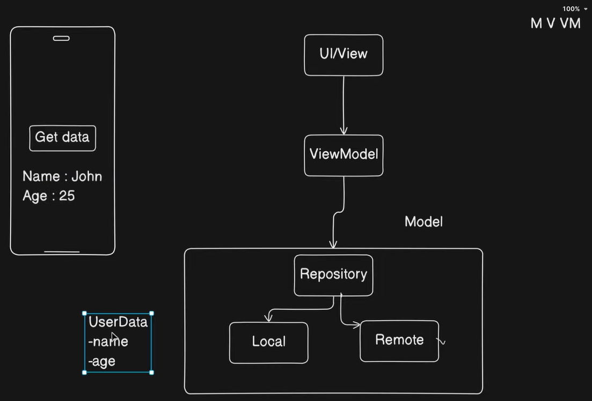

<!-- omit in toc -->
# Android MVVM 01 - Get Local Data

<!-- omit in toc -->
## Table of contents

- [App Architecture](#app-architecture)
- [Plugins](#plugins)
- [Pathway](#pathway)
- [Resources](#resources)

## App Architecture

## Plugins

## Pathway

1. Update ui.
2. Create model.
3. Create viewmodel.

## Resources

- YouTube
  - [Simple MVVM App 🔥 | Android | Jetpack Compose](https://www.youtube.com/watch?v=9eIhMFTs1Q8)
