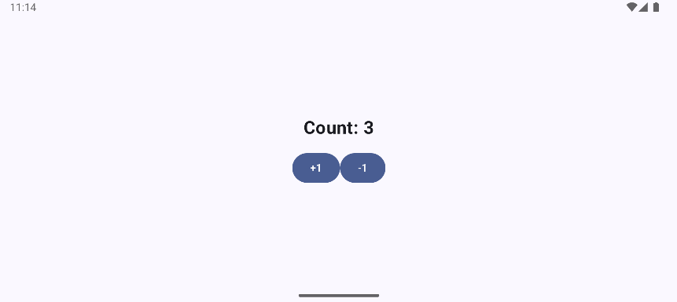

<!-- omit in toc -->
# Android MVVM 02 - Counter

<!-- omit in toc -->
## Table of contents

- [App Screenshots](#app-screenshots)
- [Dependencies](#dependencies)
- [Pathway](#pathway)
- [Resources](#resources)

## App Screenshots




## Dependencies

- AndroidBasicWithCompose/AndroidMvvm02Counter/app/build.gradle.kts

  ```kts
  dependencies {
    ...
    implementation("androidx.compose.runtime:runtime-livedata:1.8.1")
  }
  ```

## Pathway

## Resources

- GitHub
  - [abhineshchandra1234 / CounterMVVM](https://github.com/abhineshchandra1234/CounterMVVM)
- Android
  - [State and Jetpack Compose - Other supported types of state](https://developer.android.com/develop/ui/compose/state#use-other-types-of-state-in-jetpack-compose)
