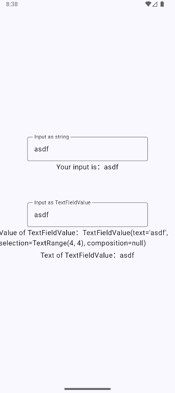
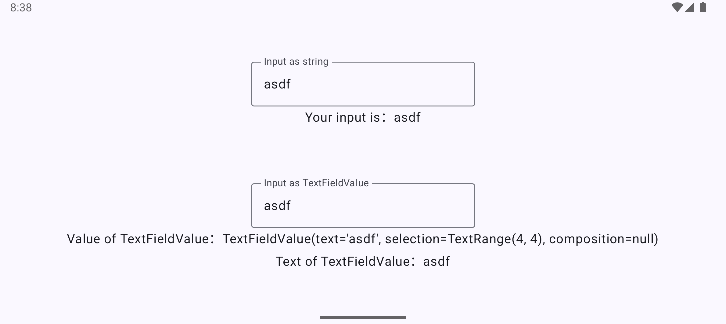

<!-- omit in toc -->
# Android MVVM 03 - Input Field

<!-- omit in toc -->
## Table of contents

- [App Screenshots](#app-screenshots)
- [App Architecture](#app-architecture)
- [Dependencies](#dependencies)
- [Pathway](#pathway)
- [My Note](#my-note)
- [Resources](#resources)

## App Screenshots





## App Architecture

- MainActivity
  - Use `ViewModelProvider`.
- View
  - App
    - Use `observeAsState`.
- ViewModel
  - AppViewModel
    - Use `MutableLiveData`.
    - Use `LiveData`.
- Model
  - (Unnecessary in this app.)

## Dependencies

- AndroidBasicWithCompose/AndroidMvvm02Counter/app/build.gradle.kts

  ```kts
  dependencies {
    ...
    implementation("androidx.compose.runtime:runtime-livedata:1.8.1")
  }
  ```

## Pathway

- Create app.
- Update ui.
  - Add basic ui components you need.
- Create empty packages.
  - view, viewmodel, model
- In model, create user repository to get datas from the API.
- In viewmodel, call the repository method.
- In view, observe the data through viewmodel and reflect in the UI.
- In MainActivity, use provider to create an instance for viewmodel.

## My Note

| Feature                 | `String`             | `TextFieldValue`                       |
| ----------------------- | -------------------- | -------------------------------------- |
| Cursor position control | ❌ Not supported      | ✅ Supported                            |
| Text selection          | ❌ Not supported      | ✅ Supported                            |
| Input method support    | Basic support        | Full support (including composition)   |
| Ease of use             | Easy (simple to use) | More complex (requires extra handling) |

## Resources

- Android
  - [State and Jetpack Compose - Other supported types of state](https://developer.android.com/develop/ui/compose/state#use-other-types-of-state-in-jetpack-compose)
  - [TextFieldValue](https://developer.android.com/reference/kotlin/androidx/compose/ui/text/input/TextFieldValue)
