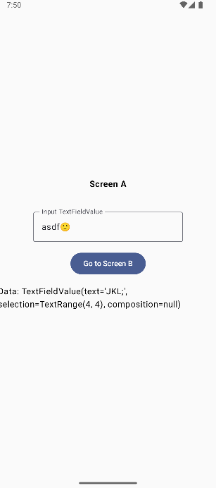
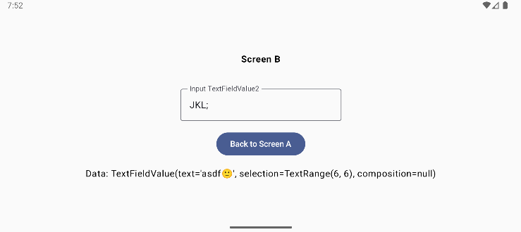

<!-- omit in toc -->
# Android MVVM 04 - Navigation

<!-- omit in toc -->
## Table of contents

- [App Screenshots](#app-screenshots)
- [App Architecture](#app-architecture)
- [Dependencies](#dependencies)
- [Pathway](#pathway)
- [My Note](#my-note)
- [Resources](#resources)

## App Screenshots





## App Architecture

- MainActivity
- AppNav
- Route
- View
  - ScreenA
  - ScreenB
- ViewModel
  - AppViewModel

## Dependencies

  ```kts
  dependencies {
    ...
    val nav_version = "2.9.0"
    implementation("androidx.navigation:navigation-compose:$nav_version")
    implementation("androidx.compose.runtime:runtime-livedata:1.8.1")
  }
  ```

## Pathway

## My Note

## Resources

- YouTube
  - [How to Navigate in Jetpack Compose 🚀 | Android Studio | 2024](https://www.youtube.com/watch?v=wJKwsI5WUI4&list=PLgpnJydBcnPA5aNrlDxxKWSqAma7m3OIl&index=5)
- Android
  - [Navigation](https://developer.android.com/guide/navigation)
  - [Compose Runtime - Declaring dependencies](https://developer.android.com/jetpack/androidx/releases/compose-runtime?authuser=1#declaring_dependencies)
