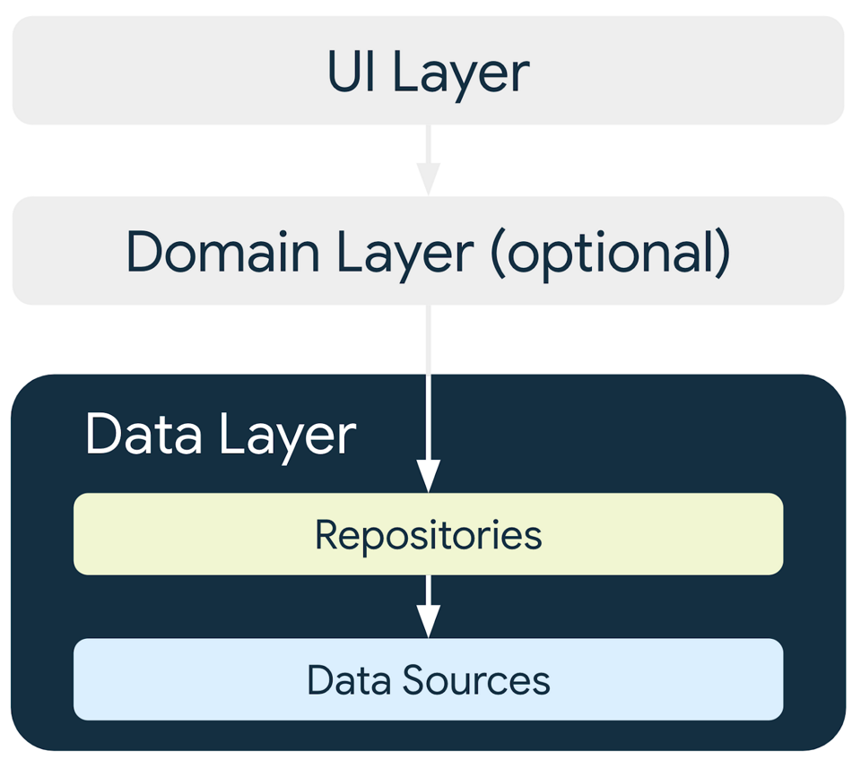
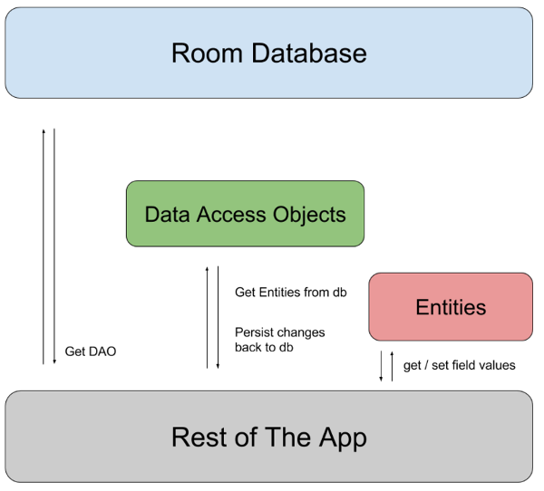
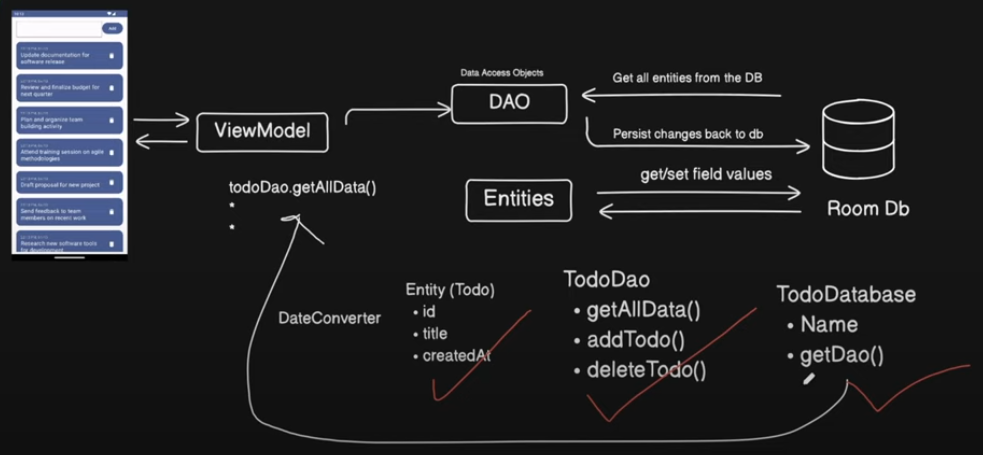

<!-- omit in toc -->
# Android MVVM 07 - Todo list with RoomDB

<!-- omit in toc -->
## Table of contents

- [App Screenshots](#app-screenshots)
- [Target](#target)
- [Dependencies](#dependencies)
- [Steps](#steps)
- [Note](#note)
- [Resources](#resources)

## App Screenshots

## App Architecture







## Target

- Learn to use RoomDB.
- Learn to use data access object (DAO).

## Dependencies

- AndroidMvvm07RoomDb/app/build.gradle.kts

  ```kts
  dependencies {
      // Compose Runtime
      implementation(libs.androidx.runtime)
      implementation(libs.androidx.runtime.livedata)
  }
  ```

- AndroidMvvm07RoomDb/gradle/libs.versions.toml

  ```toml
  [versions]
  runtime = "1.8.3"
  
  [libraries]
  androidx-runtime = { module = "androidx.compose.runtime:runtime", version.ref = "runtime" }
  androidx-runtime-livedata = { module = "androidx.compose.runtime:runtime-livedata", version.ref = "runtime" }
  
  [plugins]
  ```


## Steps

## Note

## Resources

- Android Developers
  - [Compose Runtime](https://developer.android.com/jetpack/androidx/releases/compose-runtime)
  - [Room](https://developer.android.com/jetpack/androidx/releases/room)
- GitHub
  - [basic-android-kotlin-compose-training-inventory-app](https://github.com/google-developer-training/basic-android-kotlin-compose-training-inventory-app)
  - [4_TodoApp_RoomDB](https://github.com/bimalkaf/JetpackCompose_Playground/tree/main/4_TodoApp_RoomDB)