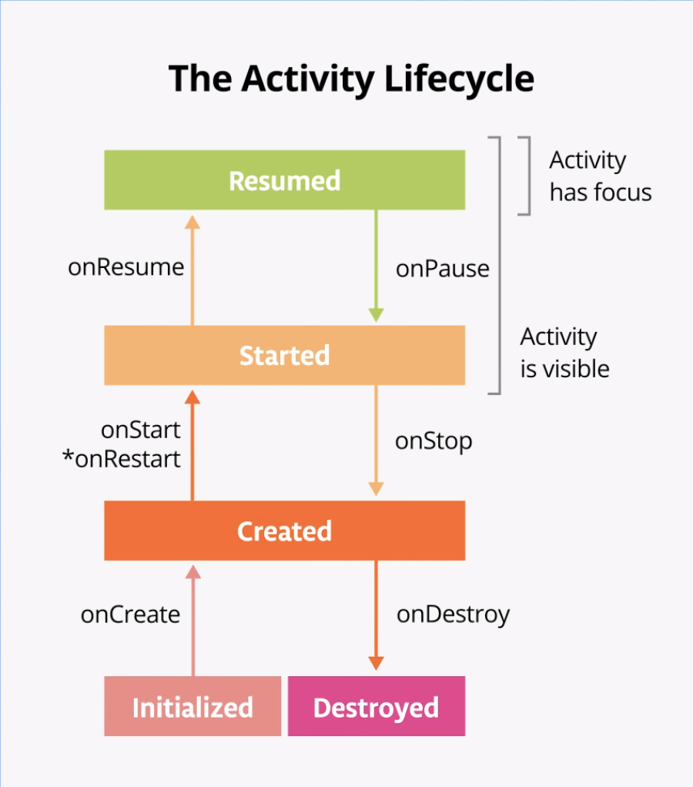

<!-- omit in toc -->

# Unit 4: Navigation and app architecture

<!-- omit in toc -->

## Table of contents

- [Pathway](#pathway)
  - [Architecture Components](#architecture-components)
  - [Navigation in Jetpack Compose](#navigation-in-jetpack-compose)
  - [Adapt for different screen sizes](#adapt-for-different-screen-sizes)
- [Resources](#resources)

## Pathway

### Architecture Components

- Stages of the Activity lifecycle

  - In Android, an activity is the entry point for interacting with the user.
  - In the past, one activity would display one screen in an app.
  - With current best practices, one activity might display multiple screens by
    swapping them in and out as needed.
  - The activity lifecycle extends from the creation of the activity to its
    destruction, when the system reclaims that activity's resources. As a user
    navigates in and out of an activity, each activity transitions between
    different states in the activity lifecycle.
  - The asterisk on the onRestart() method indicates that this method is not
    called every time the state transitions between Created and Started. It is
    only called if onStop() was called and the activity is subsequently
    restarted.

    

    | **情境**       | **Lifecycle 呼叫順序**                     |
    | -------------- | ------------------------------------------ |
    | 開啟 App       | `onCreate()` → `onStart()` → `onResume()`  |
    | 切換 App       | `onPause()` → `onStop()`                   |
    | 回到 App       | `onRestart()` → `onStart()` → `onResume()` |
    | 關閉、旋轉 App | `onPause()` → `onStop()` → `onDestroy()`   |

  - When the device or emulator rotates the screen, the system calls all the
    lifecycle callbacks to shut down the activity. Then, as the activity is
    re-created, the system calls all the lifecycle callbacks to start the
    activity.
  - Composable functions have their own lifecycle that is independent of the
    Activity lifecycle. Its lifecycle is composed of the events: enters the
    Composition, recomposing 0 or more times, and then leaving the Composition.
  - To let Compose track and trigger recomposition, state must be stored in a
    `State` or `MutableState` object. `State` is read-only, while `MutableState`
    allows both reading and writing.
  - To instruct Compose to retain and reuse its value during recompositions, you
    need to declare it with the `remember` API.
  - Use the `rememberSaveable` function to save values that you need if Android
    OS destroys and recreates the activity.
  - Configuration changes
    - A configuration change occurs when the state of the device changes so
      radically that the easiest way for the system to resolve the change is to
      destroy and rebuild the activity.
    - The most common example of a configuration change is when the user rotates
      the device from portrait to landscape mode, or from landscape to portrait
      mode. A configuration change can also occur when the device language
      changes or a user plugs in a hardware keyboard.
    - When a configuration change occurs, Android invokes all the activity
      lifecycle's shutdown callbacks. Android then restarts the activity from
      scratch, running all the lifecycle startup callbacks.
    - When Android shuts down an app because of a configuration change, it
      restarts the activity with `onCreate()`.
    - To save a value that needs to survive a configuration change, declare its
      variables with `rememberSaveable`.

- ViewModel and State in Compose
  - When apps grow, you should move data and logic away from composables. Learn
    about a robust way to design your app and preserve app data during
    configuration changes by taking advantage of the Android Jetpack library,
    `ViewModel` and Android app architecture guidelines.
  - App architecture is a set of design rules for an app. A good app
    architecture can make your code robust, flexible, scalable, testable, and
    maintainable for years to come.
  - `ViewModel`, one of the architecture components from Android Jetpack
    libraries that can store your app data. The stored data is not lost if the
    framework destroys and recreates the activities during a configuration
    change or other events. However, the data is lost if the activity is
    destroyed because of process death. The `ViewModel` only caches data through
    quick activity recreations.

### Navigation in Jetpack Compose

### Adapt for different screen sizes

## Resources

- [Unit 4: Navigation and app architecture](https://developer.android.com/courses/android-basics-compose/unit-4)
- [Guide to app architecture](https://developer.android.com/topic/architecture)
