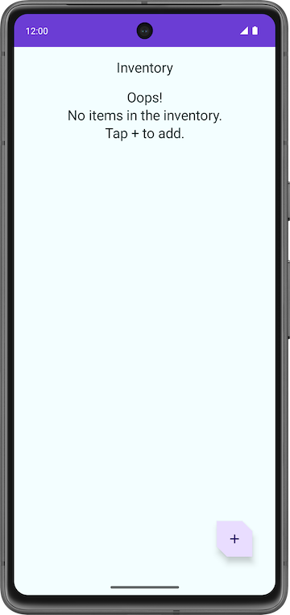
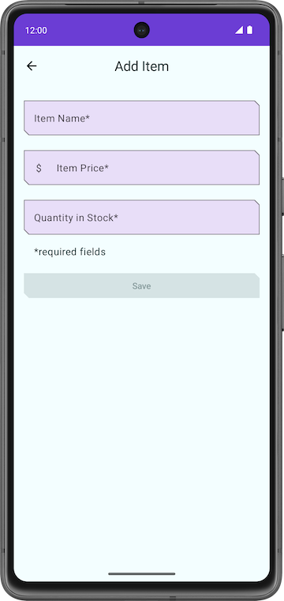

<!-- omit in toc -->
# Unit 6 - Inventory App

<!-- omit in toc -->
## Table of contents

- [App Screenshots](#app-screenshots)
- [Target](#target)
- [Dependencies](#dependencies)
- [Steps](#steps)
- [Note](#note)
- [Resources](#resources)

## App Screenshots

## Target

- Learn to use RoomDB.
- Learn to use data access object (DAO).

## Dependencies

## Steps

## Note

## Resources

- GitHub
  - [basic-android-kotlin-compose-training-inventory-app](https://github.com/google-developer-training/basic-android-kotlin-compose-training-inventory-app)
  - [4_TodoApp_RoomDB](https://github.com/bimalkaf/JetpackCompose_Playground/tree/main/4_TodoApp_RoomDB)
